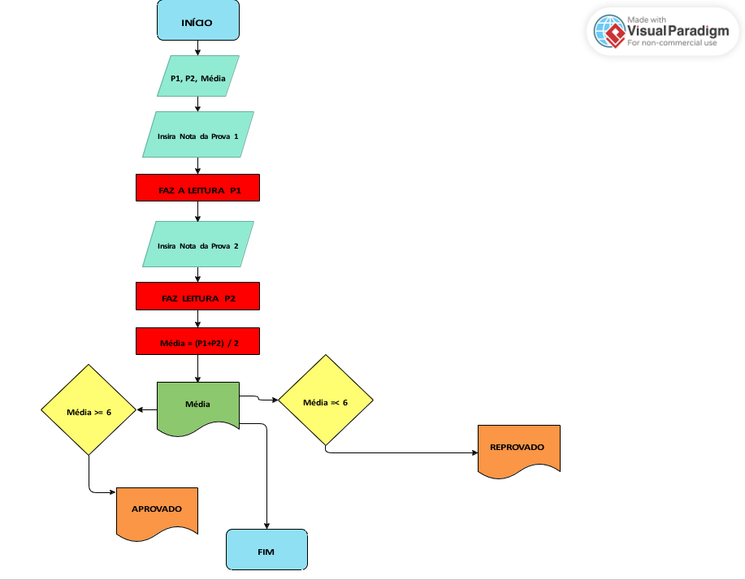

## logica-fluxograma-processos

# Modelagem de Processos e Lógica Computacional

Este repositório documenta as atividades práticas da disciplina de **Lógica e Matemática Computacional**. O foco do projeto foi o desenvolvimento de algoritmos visuais (Diagramas de Blocos) para representação de regras de negócio e tomada de decisão.

## 🎯 Objetivos do Projeto
* Compreender os princípios da lógica matemática aplicada à computação.
* Utilizar ferramentas CASE (**Visual Paradigm**) para modelagem de processos.
* Estruturar algoritmos de decisão condicional (Fluxogramas).

## 🛠️ Ferramentas Utilizadas
* **Modelagem:** Visual Paradigm Online.
* **Metodologia:** Diagrama de Blocos (Flowchart).

## 📐 O Desafio: Algoritmo de Cálculo de Média

O projeto consistiu em desenhar o fluxo lógico para um sistema de aprovação escolar. O algoritmo deve receber dados, processá-los matematicamente e tomar uma decisão baseada em uma condição lógica.

### Regras de Negócio Mapeadas:
1.  **Entrada:** Receber duas notas ($P1$ e $P2$).
2.  **Processamento:** Calcular a média aritmética: $M = \frac{P1 + P2}{2}$.
3.  **Condicional (Decisão):**
    * **SE** Média $\ge$ 6: Aluno Aprovado.
    * **SENÃO** (Média < 6): Aluno Reprovado.
    * 

[Image of flowchart symbols meaning]

## 📊 Visualização do Fluxo

Abaixo, o diagrama de blocos desenvolvido, demonstrando o fluxo de dados desde o início até o encerramento do processo.

> *Você pode baixar a versão em PDF de alta qualidade na pasta `/diagramas` ou clicando [aqui](./diagramas/Diagrama%20de%20Blocos%20para%20o%20Cálculo%20de%20Média.pdf).*

## 🏁 Conclusão e Aplicação em BI

A capacidade de transformar um problema em um diagrama visual é uma competência crítica para **Análise de Dados** e **Business Intelligence**.

Este projeto demonstra minha habilidade em:
1.  **Mapear Processos:** Entender o passo a passo de uma rotina.
2.  **Lógica Condicional:** Fundamental para criar colunas calculadas em Power BI (DAX) ou cláusulas `CASE WHEN` em SQL.
3.  **Documentação:** Uso de ferramentas visuais para tornar regras de negócio compreensíveis para stakeholders não-técnicos.

---

## 🧭 Navegação Completa pelo Portfólio

Confira os meus outros projetos técnicos desenvolvidos durante a graduação em Gestão de TI:

* 🏠 [**Voltar ao Perfil Principal**](https://github.com/cezarscarvalho)
🐧 [**Sistemas Operacionais** (Linux & VirtualBox)](https://github.com/cezarscarvalho/sistemas-operacionais-linux)
* 💻 [**Lógica de Programação** (Portugol)](https://github.com/cezarscarvalho/logica-programacao-portugol)
* 🗄️ [**Modelagem de Dados** (MySQL & DER)](https://github.com/cezarscarvalho/modelagem-dados-mysql-biblioteca)
* 🌐 [**Redes de Computadores** (Cisco Packet Tracer)](https://github.com/cezarscarvalho/projeto-cisco-packet-tracer)

## ✉️ Contato

  
  

